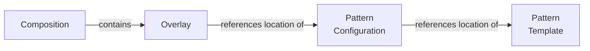

This page explains why Project Forge is the way it is.

Explanation is **discussion** that clarifies and illuminates a particular topic. Explanation is **understanding-oriented.**

- Give context and background on your library
- Explain why you created it
- Provide multiple examples and approaches of how to work with it
- Help the reader make connections
- Avoid writing instructions or technical descriptions here
- [More Information](https://diataxis.fr/explanation/)

## Overview

Project Forge is a scaffolding tool. A scaffolding tool allows developers to generate a new project by answering a few questions. Developers can go from idea to coding very quickly.

Additional needs:

- Combine several templates using composition.
- Projects can update themselves with updates from their dependent templates.
- Can use blocks within files to compose parts of files
- Don't ask the same question twice

Issues to be aware of:

- Context collisions
  - The question variable names match in two or more patterns, but their values and use are different.
- Patterns with similar questions but different names.
  - `project_name` vs. `name_of_project`
- Storage location of pattern configuration and pattern template
  - Local-Local
  - Local-Remote
  - Remote-Local
  - Remote-Remote

Similar metaphors:

- Stencil
- Pattern
- Template
- Mold
- Minting
- Composition
- Overlays

## Template engine

??

## Hooks

??

## User interface

- Provides interface for different types of questions, validation, error handling, etc
- messaging of status or state
- Abstract enough that it is pluggable for both console or web or other

- Interface
  - `type`
  - `prompt`
  - `help`
  - `choices`
  - `multiselect`
  - `default` (pre-rendered)
  - `validator` (a function to call to validate the input)
- Returns the answer

## Migrations

- The anchor for changes is:
  - The location of the
  - the hashed value of the composition and its overlays
    - This detects changes to overridden values and changes to pattern configuration locations (like a more up-to-date git reference)
  -
- What to store
  - Store the composition location
  - Store the composition contents hash to detect if its overrides have changed
    - This catches when the pattern configuration location changes (like a more up-to-date git reference)
  - For each pattern
    - Store the requested location from the overlay
    - This will provide information if a specific version of the pattern was requested
      - The location may be very generic (like a GitHub repo), or very specific (commit 123456 of the repo)
    - Store the location used:
      - For git URLs, this would be a URL to a specific reference
      - Will need to be able to resolve the specificity of Git references
        - branches -> current commit
        - tags -> commit
