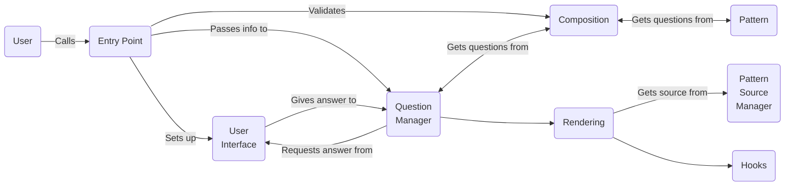
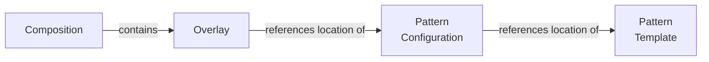

This page explains why Project Forge is the way it is.

Explanation is **discussion** that clarifies and illuminates a particular topic. Explanation is **understanding-oriented.**

- Give context and background on your library
- Explain why you created it
- Provide multiple examples and approaches of how to work with it
- Help the reader make connections
- Avoid writing instructions or technical descriptions here
- [More Information](https://diataxis.fr/explanation/)

## Overview

Project Forge is a scaffolding tool. A scaffolding tool allows developers to generate a new project by answering a few questions. Developers can go from idea to coding very quickly.

Additional needs:
- Combine several templates using composition.
- Projects can update themselves with updates from their dependent templates.
- Can use blocks within files to compose parts of files
- Don't ask the same question twice

Issues to be aware of:
- Context collisions
    - The question variable names match in two or more patterns, but their values and use are different.
- Patterns with similar questions but different names.
    - `project_name` vs. `name_of_project`
- Storage location of pattern configuration and pattern template
    - Local-Local
    - Local-Remote
    - Remote-Local
    - Remote-Remote

Similar metaphors:
- Stencil
- Pattern
- Template
- Mold
- Minting
- Composition
- Overlays

## Elements

- **Location.** A location is a reference to a source.
- **Pattern.** A set of template files to render and a rendering configuration file.
- **Pattern source management.** Downloading and caching the pattern sources (git repos, local directories) 
- **Overlay.** A reference to a pattern and the configuration for using it in a specific composition.
- **Composition.** A list of overlays and context to render a project.
- **Template Rendering Engine.** The system that defines the structure of the templates and renders them into the final product
- **Hooks.** Scripts that are stored in a specific place and executed before or after the generation process.
- **Context.** The set of values that the *template rendering engine* uses to render templates
- **Question management.** Manages the questions across multiple overlays in a composition. Handles actual validation (Passes UI a validation function for each question)
- **User input.** Manages the questioning, validation, and error handling of user input for the pattern questions.
- **Migrations.** Adding overlays and updating overlays on projects

## Location

The location is a hashable reference to a source. A location consists of a `url` and `path` combination.

At least one of `path` or `url` must be specified. When `url` is specified, the `path` is resolved using the root of the repository. When `url` is unspecified, the path is resolved using the local filesystem and current working directory.

### Examples

- Supports normal URLs (scheme://netloc/path;parameters?query#fragment) and SSH urls (user@domain/path)

- specify branches, tags, or commits

    - GitHub: 
        - `https://github.com/owner/repository/tree/[branch-or-tag]`
        - `https://github.com/owner/repository/commit/[commit-SHA]`
    - GitLab: 
        - `https://gitlab.com/owner/repository/-/tree/[branch-or-tag]`
        - `https://gitlab.com/owner/repository/-/commit/[commit-SHA]`
    - Using `@` or `#`: 
        - `https://<domain>/owner/repository@[branch/tag/commit]`
        - `https://<domain>/owner/repository#[branch/tag/commit]`

- relative or absolute path to the object within the URL or local filesystem

## Pattern

A _pattern_ consists of a set of template files and a configuration file. The configuration file defines the context required to render the template and the rendering rules.

*Patterns* are meant to be focused and reusable. *Patterns* are combined with other *patterns* using a *composition.*

*Patterns* are renderable as-is. They do not need to be a part of a composition. 

### Pattern configuration

The pattern configuration file have a flexible suffix: `.yaml`, `.json`, `.toml`

Includes:

- Pattern settings
- Question objects
- Choice objects

### Pattern Templates

- how context is presented
- can you have templates fill parts of other overlays? 
    - Like treating each overlay as a chain map
- need to figure out how to use inheritance and multiple sources of templates
- need to figure out all the files (including overwrites and )

## Pattern source manager

- Contains the interface for accessing local copies of the pattern templates
- Caching logic
    - Local checkouts for remote repositories
- Hashing sources to detect changes

### Sources of patterns

- Local directory
    - For local Git repositories, we will need to deal with the potential of a dirty repo and how that affects the snapshot
        - Treat it as a Non-Git repository
        - Don't allow dirty repositories: raise an error
    - Non-Git directories
        - Hash the contents of the directory.
        - Treat it as "always new".

## Composition

A composition defines a set of overlays and how they should interact.

The composition file is a list of overlay objects. An overlay is a reference to a pattern configuration with the ability to adjust the pattern's configuration.

## Template engine

??

## Hooks

??

## Context

??

## Question manager

- Treats everything as a composition.
- Resolves the dependency tree for questions across all overlays
- Uses the *User Interface* to ask questions and updates context and dependencies
- Output is a single context used to render all templates
- Handles validation
    - Can pass validation function for each question to user interface
- Interface:
    - `Pattern` or `Composition`
    - `UI` (reference)

## User interface

- Provides interface for different types of questions, validation, error handling, etc
- messaging of status or state
- Abstract enough that it is pluggable for both console or web or other

- Interface
    - `type`
    - `prompt`
    - `help`
    - `choices`
    - `multiselect`
    - `default` (pre-rendered)
    - `validator` (a function to call to validate the input)
- Returns the answer

## Migrations

- The anchor for changes is:
    - The location of the 
    - the hashed value of the composition and its overlays
        - This detects changes to overridden values and changes to pattern configuration locations (like a more up-to-date git reference)
    - 
- What to store
    - Store the composition location
    - Store the composition contents hash to detect if its overrides have changed
        - This catches when the pattern configuration location changes (like a more up-to-date git reference)
    - For each pattern
        - Store the requested location from the overlay
        - This will provide information if a specific version of the pattern was requested
            - The location may be very generic (like a GitHub repo), or very specific (commit 123456 of the repo)
        - Store the location used:
            - For git URLs, this would be a URL to a specific reference
            - Will need to be able to resolve the specificity of Git references
                - branches -> current commit
                - tags -> commit
